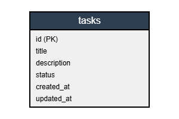

# WAD - API de Gerenciamento de Tarefas

## Introdução

Este documento apresenta o desenvolvimento de uma API simples de gerenciamento de tarefas utilizando Node.js, Express e PostgreSQL, seguindo o padrão de arquitetura MVC (Model-View-Controller). O projeto foi desenvolvido como parte da atividade ponderada do módulo 2, com foco na estruturação adequada de um projeto web e na implementação de uma API para operações CRUD.

A API permite criar, visualizar, editar e excluir tarefas através de endpoints REST, fornecendo respostas JSON para visualização clara das operações. O sistema foi projetado com foco na simplicidade e eficiência, atendendo apenas aos requisitos essenciais.

## Arquitetura do Sistema

O projeto segue a arquitetura MVC (Model-View-Controller), que separa a aplicação em três componentes principais:

1. **Model**: Responsável pela estrutura de dados e interação com o banco de dados.
2. **Controller**: Responsável pela lógica de negócio e processamento das requisições.
3. **Routes**: Responsável pelo roteamento das requisições HTTP para os controllers apropriados.

Esta separação de responsabilidades facilita a manutenção, escalabilidade e testabilidade do código.

## Diagrama do Banco de Dados

O banco de dados foi projetado de forma simples, contendo apenas a tabela de tarefas:

<center>

</center>

### Descrição da Tabela

**tasks**
- id (PK): Identificador único da tarefa
- title: Título da tarefa (obrigatório)
- description: Descrição detalhada da tarefa
- status: Estado atual da tarefa (pendente, em andamento, concluída)
- created_at: Data de criação do registro
- updated_at: Data da última atualização

## Tecnologias Utilizadas

### Backend
- **Node.js**: Ambiente de execução JavaScript do lado do servidor
- **Express.js**: Framework web para Node.js
- **PostgreSQL**: Sistema de gerenciamento de banco de dados relacional
- **ejs** : estrutura similar ao HTML mas, ao invés de mostrar tudo de forma estática, renderiza esses elementos HTML podendo haver estruturas Javascript dentro do código. 

### Bibliotecas
- **pg**: Cliente PostgreSQL para Node.js
- **dotenv**: Carregamento de variáveis de ambiente

## Endpoints da API

A API disponibiliza os seguintes endpoints:

| Método | Endpoint | Descrição |
|--------|----------|-----------|
| GET | / | Verifica o status da API e lista todos os endpoints disponíveis |
| GET | /api/tasks | Lista todas as tarefas |
| GET | /api/tasks/:id | Busca uma tarefa específica pelo ID |
| POST | /api/tasks | Cria uma nova tarefa |
| PUT | /api/tasks/:id | Atualiza uma tarefa existente |
| DELETE | /api/tasks/:id | Exclui uma tarefa |

## Implementação

### Configuração do Banco de Dados

A conexão com o banco de dados PostgreSQL é configurada no arquivo `config/database.js`, utilizando o pacote `pg` e variáveis de ambiente para maior segurança:

```javascript
const { Pool } = require('pg');

const pool = new Pool({
  user: process.env.DB_USER || 'postgres',
  host: process.env.DB_HOST || 'localhost',
  database: process.env.DB_NAME || 'task_manager',
  password: process.env.DB_PASSWORD || 'postgres',
  port: process.env.DB_PORT || 5432,
  ssl: process.env.DB_SSL === 'true' ? { rejectUnauthorized: false } : false
});

module.exports = pool;
```

### Implementação dos Models

O modelo `Task.js` encapsula a lógica de acesso ao banco de dados, fornecendo métodos para realizar operações CRUD:

```javascript
// Exemplo do método findAll()
static async findAll() {
  try {
    const result = await pool.query('SELECT * FROM tasks ORDER BY created_at DESC');
    return result.rows;
  } catch (error) {
    console.error('Erro ao buscar tarefas:', error);
    throw error;
  }
}
```

### Implementação dos Controllers

O controller `TaskController.js` processa as requisições HTTP, interage com o modelo para acessar ou modificar dados, e retorna respostas JSON:

```javascript
// Exemplo do método listTasks()
static async listTasks(req, res) {
  try {
    const tasks = await Task.findAll();
    res.status(200).json({
      success: true,
      message: 'Tarefas recuperadas com sucesso',
      data: tasks
    });
  } catch (error) {
    console.error('Erro ao listar tarefas:', error);
    res.status(500).json({
      success: false,
      message: 'Erro ao recuperar tarefas',
      error: error.message
    });
  }
}
```

### Implementação das Rotas

As rotas são definidas no arquivo `routes/index.js`, conectando URLs aos métodos do controller:

```javascript
// Rotas para tarefas
router.get('/api/tasks', TaskController.listTasks);
router.get('/api/tasks/:id', TaskController.getTask);
router.post('/api/tasks', TaskController.createTask);
router.put('/api/tasks/:id', TaskController.updateTask);
router.delete('/api/tasks/:id', TaskController.deleteTask);
```

## Desafios e Soluções

Durante o desenvolvimento do projeto, os principais desafios foram:

1. **Simplificação do projeto**: Manter o foco apenas nos requisitos essenciais, removendo funcionalidades como autenticação e views.

2. **Integração com o banco de dados**: Configurar corretamente a conexão com o PostgreSQL e implementar operações assíncronas.

3. **Tratamento de erros**: Garantir respostas adequadas em caso de falhas nas operações de banco de dados.

As soluções adotadas incluíram a implementação de uma estrutura minimalista, focada apenas nas operações CRUD essenciais, e o uso de respostas JSON padronizadas para facilitar a visualização dos resultados.

## Conclusão

A API de Gerenciamento de Tarefas demonstra a aplicação prática dos conceitos de desenvolvimento web com Node.js, Express e PostgreSQL, seguindo o padrão MVC. A implementação focou apenas nos requisitos essenciais, resultando em uma API simples, mas funcional e bem estruturada.

O código está organizado de forma modular e segue boas práticas de desenvolvimento, tornando-o fácil de entender e manter. A documentação detalhada e as instruções de instalação garantem que outros desenvolvedores possam utilizar e contribuir para o projeto.

## Referências

- Node.js Documentation: https://nodejs.org/en/docs/
- Express.js Documentation: https://expressjs.com/
- PostgreSQL Documentation: https://www.postgresql.org/docs/
- MDN Web Docs: https://developer.mozilla.org/
- ejs : https://ejs.co/
